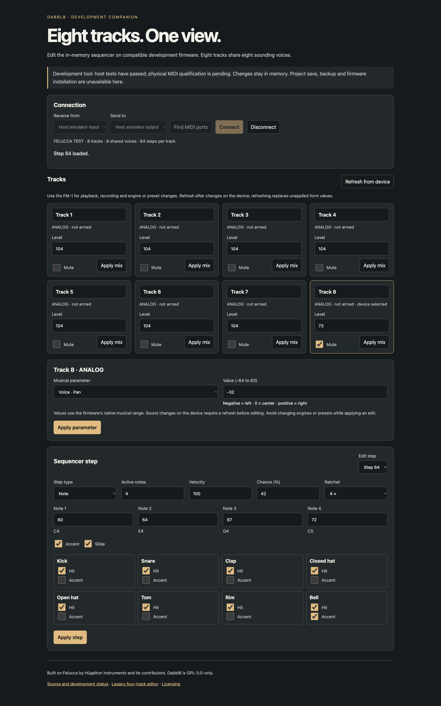

# Companion page evidence — 10 October 2026

Preparatory issue #11 page, based on transport commit
`53bde7e1d57a4f0cfc5c25b80c0e3dd237efe719`. Both optimized and sanitizer host-C
model sections passed 48 checks; the complete pinned upstream/extended suite
passed exit 0. Standalone and integrated raw sections, full-log/source hashes,
command, exact musical descriptor checks and browser evidence are preserved.

All 1,386 engine/parameter combinations match the actual pinned export. Actual
C tests cover all eight selections/mix/pan destinations and their independent
values, full last-step capture, ranges, changed-sound review and closure between
follow-up reads. Mock wrappers cover external sound changes and delayed callbacks;
these are not physical engine-change/timing tests. Existing 85 transport, 144
client and 186 protocol sections also passed twice in the full suite.

Chrome used production page/model/client/transport with injected simulated ports
and a localhost bridge forwarding only 1/75/77 to the actual eight-track C parser.
Track8 level73/mute/pan-32 and step64 notes60/64/67/72, both flags, velocity100,
hit255/accent128/chance42/ratchet4 round-tripped; other mixer values stayed104 and
unmuted. Invalid pan64 refused. Final DOM, desktop1440x900 and mobile390x844
screenshots show the preserved values; neither width had horizontal overflow.
Four-track capability shape, permission refusal and cancelled late discovery were
mock browser cases. Actual four-track read-only behavior is separately tested via
C. Console inspection reported no application warnings/errors. Initial favicon404
and a stale private-fixture cache timestamp were preview-harness observations,
not ignored app failures; the timestamp was corrected and final source reloaded.

Node model/test source was constant through the full suite. Renderer connection-
generation/page-exit guards were added during that run and the final renderer was
separately reloaded and verified in Chrome; the suite does not automate its DOM.
Raw browser fixture/server/requests are outside Git under
`.local-baseline/companion-page-check`; every real-handler response checked zero
simulated flash writes/erases. The preview server and bridge were stopped after
verification. No actual MIDI permission, ports, backup, flash or installation.

Default Mac app/package/loader and reference hashes remain unchanged. No new
compiler target image or memory claim for this web-only stage. Four local omissions
and hardware SKIP remain explicit. Hosted CI is pending the new draft. Visible
controls do not complete new-format save/backup round trips or #7/#9/hardware gates;
issue #11 remains open. See [page contracts](../../companion-editor-page.md).

[Mobile host-simulator preview](mobile.jpg)
